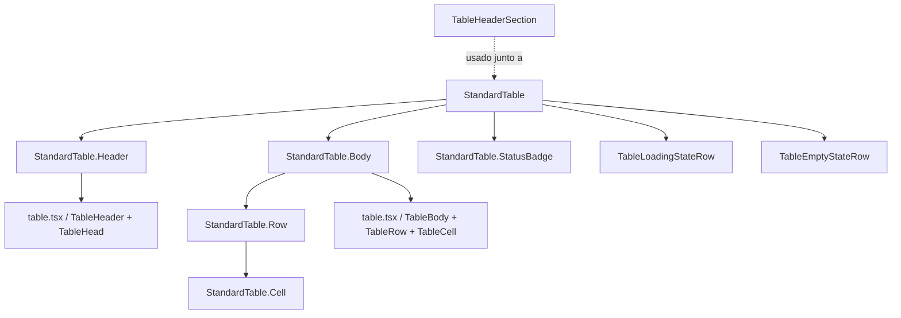

# Design Document — Standardized Table Design

## Overview

Este documento describe el diseño técnico para estandarizar el sistema visual de tablas en toda la aplicación. La referencia de diseño es `DevolucionesPage.tsx`, que ya implementa el estilo deseado mediante CSS-in-JS con tokens propios. El objetivo es extraer ese sistema a componentes y clases CSS reutilizables para que todos los módulos puedan adoptarlo de forma incremental.

La estrategia central es:
1. Agregar tokens CSS de estado a `globals.css` y ajustar la clase `elegante-input` para fondo negro.
2. Crear el componente `StandardTable` en `src/shared/components/ui/standard-table.tsx` con subcomponentes tipados.
3. Actualizar `TableHeaderSection` para que el contador de registros quede siempre a la derecha.
4. Migrar cada módulo de forma incremental, módulo por módulo, sin romper funcionalidad existente.

---

## Architecture

El sistema se organiza en tres capas:

```
┌─────────────────────────────────────────────────────────┐
│                    Capa de Módulos                       │
│  VentasPage, ClientesPage, ProductosPage, ...           │
│  (consumen StandardTable + TableHeaderSection)          │
└────────────────────┬────────────────────────────────────┘
                     │ usa
┌────────────────────▼────────────────────────────────────┐
│              Capa de Componentes Compartidos             │
│  StandardTable  ←→  TableHeaderSection                  │
│  StandardTable.Header / Body / Row / Cell / StatusBadge │
│  TableEmptyStateRow / TableLoadingStateRow              │
└────────────────────┬────────────────────────────────────┘
                     │ consume
┌────────────────────▼────────────────────────────────────┐
│                  Capa de Design Tokens                   │
│  src/styles/globals.css                                  │
│  --gray-lightest, --gray-darker, --black-secondary,     │
│  --orange-primary, --status-green, --status-red         │
└─────────────────────────────────────────────────────────┘
```

### Decisiones de diseño

**CSS classes vs. inline styles**: Se usan clases CSS globales en `globals.css` en lugar de inline styles o Tailwind arbitrarios. Esto permite que los módulos que no migren al componente completo puedan adoptar el estilo aplicando clases directamente.

**Subcomponentes vs. prop `columns`/`data`**: `StandardTable` expone ambas APIs. La API de props (`columns` + `data`) es conveniente para tablas simples. Los subcomponentes (`StandardTable.Row`, `StandardTable.Cell`) son necesarios para tablas con filas expandibles, agrupadas o con lógica de renderizado compleja (como DevolucionesPage).

**No se reemplaza `table.tsx`**: Los componentes base (`Table`, `TableHeader`, etc.) se mantienen. `StandardTable` los envuelve y les aplica las clases estándar, preservando retrocompatibilidad.

---

## Components and Interfaces

### Diagrama de componentes



### `StandardTable` — componente principal

**Archivo**: `src/shared/components/ui/standard-table.tsx`

```typescript
// API de props (tablas simples)
type ColumnDef<T> = {
  key: keyof T | string;
  header: string;
  align?: "left" | "center" | "right";
  render?: (value: unknown, row: T) => React.ReactNode;
};

type StandardTableProps<T extends Record<string, unknown>> = {
  columns: ColumnDef<T>[];
  data: T[];
  loading?: boolean;
  emptyMessage?: string;
  emptyTitle?: string;
  onReload?: () => void;
  className?: string;
  rowKey?: keyof T | ((row: T) => string);
};
```

El componente renderiza:
- Un `<table>` con clase `std-table` (border-collapse: collapse, DM Sans, fondo gray-darkest).
- Un `<thead>` con clase `std-thead` (estilos de encabezado estándar).
- Un `<tbody>` con clase `std-tbody`.
- Cuando `loading=true`: reemplaza el tbody con `TableLoadingStateRow`.
- Cuando `data` vacío y `loading=false`: reemplaza el tbody con `TableEmptyStateRow`.

**Subcomponentes estáticos** (para uso flexible):

| Subcomponente | Descripción |
|---|---|
| `StandardTable.Header` | `<thead>` con estilos estándar |
| `StandardTable.HeadCell` | `<th>` con padding, uppercase, letter-spacing |
| `StandardTable.Body` | `<tbody>` con `[&_tr:last-child]:border-0` |
| `StandardTable.Row` | `<tr>` con border-bottom y hover |
| `StandardTable.Cell` | `<td>` con color gray-lightest, centrado |
| `StandardTable.PrimaryCell` | `<td>` primera columna, color white-primary, text-left |
| `StandardTable.StatusBadge` | Badge de estado con variantes positivo/negativo/neutro |

### `StandardTable.StatusBadge`

```typescript
type StatusVariant = "positive" | "negative" | "neutral";

type StatusBadgeProps = {
  variant: StatusVariant;
  label: string;
};
```

Mapeo de variantes a estilos:

| Variante | Background | Color texto | Uso típico |
|---|---|---|---|
| `positive` | `#7aab8a` (--status-green) | `#212020` | Completada, Activo, Pagado, Disponible |
| `negative` | `#b07070` (--status-red) | `#212020` | Anulada, Cancelada, Inactivo, Rechazado |
| `neutral` | `#4a4a4a` | `#f3f4f6` | Pendiente, En proceso, Parcial |

Estilos invariantes del badge: `border-radius: 9999px`, `font-size: 11px`, `font-weight: 700`, `min-width: 5rem`, `padding: 3px 12px`, `display: inline-block`, `text-align: center`, `white-space: nowrap`.

### `TableHeaderSection` — cambios

El componente ya soporta `recordsPlacement="right"` (valor por defecto). Los cambios necesarios son:

1. **Fondo del buscador**: La clase `elegante-input` actualmente usa `--search-filter-bg: #333232`. Se agrega una variante `elegante-input-dark` que usa `--black-secondary: #111111`. `TableHeaderSection` usará `elegante-input-dark` por defecto cuando se use junto a `StandardTable`.
2. **Prop `variant`**: Se agrega `variant?: "default" | "dark"` a `TableHeaderSectionProps`. Cuando `variant="dark"`, el buscador y el select usan `elegante-input-dark`.
3. El contador ya se posiciona a la derecha con `recordsPlacement="right"` — no requiere cambios estructurales.

---

## Data Models

### `ColumnDef<T>`

```typescript
type ColumnDef<T> = {
  /** Clave del campo en el objeto de datos, o string arbitrario para columnas calculadas */
  key: keyof T | string;
  /** Texto del encabezado de columna */
  header: string;
  /** Alineación de la celda. Default: "center". Primera columna: "left" */
  align?: "left" | "center" | "right";
  /** Función de renderizado personalizado. Si no se provee, se usa el valor directo */
  render?: (value: unknown, row: T) => React.ReactNode;
  /** Si true, esta columna se trata como columna primaria (color white-primary) */
  primary?: boolean;
};
```

### `StatusVariant` — mapeo de strings de estado

Los módulos existentes usan strings de estado variados. Se provee una función utilitaria `resolveStatusVariant` para mapear strings a variantes:

```typescript
function resolveStatusVariant(status: string): StatusVariant {
  const normalized = status.toLowerCase().trim();
  const POSITIVE = ["completada", "activo", "activa", "pagado", "pagada", "disponible", "aprobado", "aprobada"];
  const NEGATIVE = ["anulada", "anulado", "cancelada", "cancelado", "inactivo", "inactiva", "rechazado", "rechazada"];
  if (POSITIVE.includes(normalized)) return "positive";
  if (NEGATIVE.includes(normalized)) return "negative";
  return "neutral";
}
```

Esta función es pura y determinista, lo que la hace ideal para property-based testing.

---

## Correctness Properties

*Una propiedad es una característica o comportamiento que debe ser verdadero en todas las ejecuciones válidas del sistema — esencialmente, una declaración formal sobre lo que el software debe hacer. Las propiedades sirven como puente entre especificaciones legibles por humanos y garantías de corrección verificables automáticamente.*

Este feature involucra lógica de renderizado de componentes React y funciones de transformación puras (mapeo de variantes, formateo de contadores). PBT es aplicable para las funciones puras y para verificar invariantes de renderizado que deben sostenerse para cualquier conjunto de datos de entrada.

**Librería PBT**: [`fast-check`](https://github.com/dubzzz/fast-check) — compatible con Vitest y el stack React/TypeScript del proyecto.

---

### Property 1: StatusBadge siempre aplica estilos invariantes

*Para cualquier* string de estado (positivo, negativo, neutro o desconocido), el `StatusBadge` renderizado siempre debe tener `border-radius: 9999px`, `font-size: 11px`, `font-weight: 700`, y `min-width: 5rem`, independientemente del valor del estado.

**Validates: Requirements 3.5**

---

### Property 2: StatusBadge positivo siempre usa Status_Green

*Para cualquier* string de estado que pertenezca al conjunto de estados positivos (Completada, Activo, Pagado, Disponible, Aprobado), el `StatusBadge` renderizado debe tener background `#7aab8a` y color de texto `#212020`.

**Validates: Requirements 3.1**

---

### Property 3: StatusBadge negativo siempre usa Status_Red

*Para cualquier* string de estado que pertenezca al conjunto de estados negativos (Anulada, Cancelada, Inactivo, Rechazado), el `StatusBadge` renderizado debe tener background `#b07070` y color de texto `#212020`.

**Validates: Requirements 3.2**

---

### Property 4: Encabezados de tabla aplican estilos invariantes para cualquier definición de columnas

*Para cualquier* array de definiciones de columnas (con al menos una columna), todos los elementos `<th>` renderizados deben tener `padding: 13px 16px`, `font-size: 11px`, `text-transform: uppercase`, `letter-spacing: 0.06em`, y `white-space: nowrap`.

**Validates: Requirements 4.1, 4.3, 4.4, 4.5**

---

### Property 5: Primera columna izquierda, resto centradas

*Para cualquier* array de definiciones de columnas con al menos 2 columnas, el primer `<th>` debe tener `text-align: left` y todos los demás deben tener `text-align: center`.

**Validates: Requirements 4.2**

---

### Property 6: Todas las filas excepto la última tienen border-bottom

*Para cualquier* array de datos no vacío, todos los `<tr>` del `<tbody>` excepto el último deben tener `border-bottom: 1px solid var(--gray-darker)`, y el último `<tr>` no debe tener `border-bottom`.

**Validates: Requirements 5.1, 5.4**

---

### Property 7: loading=true siempre muestra estado de carga, independientemente de los datos

*Para cualquier* array de datos (vacío, con un elemento, o con múltiples elementos), cuando `loading=true`, el componente `StandardTable` debe renderizar `TableLoadingStateRow` y no debe renderizar ninguna fila de datos.

**Validates: Requirements 8.5**

---

### Property 8: resolveStatusVariant es determinista y exhaustiva

*Para cualquier* string de estado, `resolveStatusVariant` debe retornar exactamente uno de `"positive"`, `"negative"`, o `"neutral"`, y el resultado debe ser el mismo para el mismo input (determinismo). Además, strings del mismo estado en diferente capitalización deben retornar la misma variante.

**Validates: Requirements 3.1, 3.2, 3.3**

---

## Error Handling

### Datos inválidos o inesperados

| Situación | Comportamiento esperado |
|---|---|
| `data` es `undefined` o `null` | `StandardTable` trata como array vacío y muestra `TableEmptyStateRow` |
| `columns` vacío | Renderiza tabla sin columnas (thead vacío, tbody vacío) sin lanzar error |
| `render` de columna lanza excepción | El error se propaga al Error Boundary del módulo padre |
| `status` string no reconocido en `StatusBadge` | `resolveStatusVariant` retorna `"neutral"` como fallback |
| `rowKey` no encuentra clave en el objeto | Usa el índice del array como fallback para la key de React |

### Carga de fuente DM Sans

Si Google Fonts no está disponible (sin conexión, bloqueado por CSP), el sistema cae en `'Segoe UI', sans-serif` de forma natural por la declaración de font-family en cascada. No se requiere manejo de error explícito.

### Migración incremental

Durante la migración, un módulo puede estar en estado mixto (parte del módulo usa `StandardTable`, parte usa los componentes base). Esto es válido y no genera errores porque `StandardTable` no modifica los componentes base.

---

## Testing Strategy

### Enfoque dual

Se usan dos tipos de tests complementarios:

- **Tests de ejemplo** (Vitest + React Testing Library): verifican comportamientos específicos, casos de borde y renderizado condicional.
- **Tests de propiedad** (fast-check + Vitest): verifican invariantes universales sobre funciones puras y renderizado con datos generados.

### Tests de propiedad (fast-check)

Cada propiedad del documento se implementa como un test de propiedad con mínimo **100 iteraciones**. Cada test lleva un comentario de trazabilidad:

```typescript
// Feature: standardized-table-design, Property 1: StatusBadge siempre aplica estilos invariantes
```

**Configuración de fast-check**:
```typescript
import fc from "fast-check";

// Mínimo 100 iteraciones por propiedad
fc.assert(fc.property(...), { numRuns: 100 });
```

**Arbitrarios relevantes**:
- `fc.constantFrom(...POSITIVE_STATUSES)` — genera strings de estado positivo
- `fc.constantFrom(...NEGATIVE_STATUSES)` — genera strings de estado negativo
- `fc.array(fc.record({ key: fc.string(), header: fc.string() }), { minLength: 1 })` — genera definiciones de columnas
- `fc.array(fc.record({ id: fc.uuid(), name: fc.string() }), { minLength: 1 })` — genera arrays de datos

### Tests de ejemplo (Vitest + RTL)

Se escriben tests de ejemplo para:
- Renderizado con `loading=true` y `loading=false`
- Renderizado con `data` vacío
- Aplicación de clases CSS en encabezados y celdas
- Comportamiento del contador de registros con `recordsPlacement="right"`
- Compatibilidad de `TableHeaderSection` con `variant="dark"`
- Importación y exportación de subcomponentes

### Tests de integración

Después de migrar cada módulo, se verifica con un test de integración que:
- El módulo renderiza sin errores con datos reales (mock del servicio)
- La paginación, búsqueda y filtros siguen funcionando
- Los badges de estado muestran los colores correctos

### Archivos de test

```
src/shared/components/ui/__tests__/
  standard-table.test.tsx          # Tests de ejemplo del componente
  standard-table.property.test.tsx # Tests de propiedad (fast-check)
  status-badge.property.test.tsx   # Tests de propiedad del StatusBadge
  resolve-status-variant.test.ts   # Tests de la función utilitaria
```

---

## Migration Strategy

La migración es incremental: cada módulo se migra de forma independiente. El orden sugerido va de menor a mayor complejidad.

### Cambios globales (Fase 0 — prerequisito)

Estos cambios se hacen una sola vez antes de migrar cualquier módulo:

**1. `src/styles/globals.css`** — agregar tokens y clase:

```css
:root {
  /* Nuevos tokens de estado */
  --status-green: #7aab8a;
  --status-red: #b07070;
}

@theme inline {
  --color-status-green: var(--status-green);
  --color-status-red: var(--status-red);
}

@layer components {
  /* Variante dark para inputs de búsqueda/filtro */
  .elegante-input-dark {
    background-color: var(--black-secondary);  /* #111111 */
    border: 1px solid var(--gray-darker);
    color: var(--color-white-primary);
    border-radius: 8px;
    padding: 9px 14px;
    font-family: 'DM Sans', 'Segoe UI', sans-serif;
  }
  .elegante-input-dark:focus {
    outline: none;
    border-color: var(--orange-primary);
    box-shadow: 0 0 0 1px var(--orange-primary);
  }
  .elegante-input-dark::placeholder {
    color: var(--gray-dark);
  }

  /* Clases de tabla estándar */
  .std-table {
    width: 100%;
    border-collapse: collapse;
    font-family: 'DM Sans', 'Segoe UI', sans-serif;
    background: var(--gray-darkest);
  }

  .std-thead th {
    padding: 13px 16px;
    font-size: 11px;
    font-weight: 700;
    color: var(--gray-lightest);
    text-align: center;
    letter-spacing: 0.06em;
    text-transform: uppercase;
    border-bottom: 1px solid var(--gray-darker);
    white-space: nowrap;
    background: var(--gray-darkest);
  }
  .std-thead th:first-child {
    text-align: left;
    padding-left: 20px;
  }

  .std-tbody tr {
    border-bottom: 1px solid var(--gray-darker);
    transition: background 0.12s;
  }
  .std-tbody tr:last-child {
    border-bottom: none;
  }
  .std-tbody tr:hover {
    background: var(--gray-darker);
  }

  .std-td {
    padding: 12px 16px;
    font-size: 13px;
    color: var(--gray-lightest);
    text-align: center;
    vertical-align: middle;
  }
  .std-td-primary {
    padding: 12px 16px;
    padding-left: 20px;
    font-size: 13px;
    color: var(--white-primary);
    text-align: left;
    vertical-align: middle;
  }

  /* Status badge estándar */
  .std-badge {
    display: inline-block;
    padding: 3px 12px;
    border-radius: 9999px;
    font-size: 11px;
    font-weight: 700;
    white-space: nowrap;
    min-width: 5rem;
    text-align: center;
  }
  .std-badge-positive {
    background: var(--status-green);
    color: var(--black-primary);
  }
  .std-badge-negative {
    background: var(--status-red);
    color: var(--black-primary);
  }
  .std-badge-neutral {
    background: #4a4a4a;
    color: #f3f4f6;
  }
}
```

**2. `src/shared/components/ui/table-header-section.tsx`** — agregar prop `variant`:

```typescript
type TableHeaderSectionProps = {
  // ... props existentes ...
  variant?: "default" | "dark";  // nuevo
};
```

Cuando `variant="dark"`, el `Input` y el `SelectTrigger` usan `elegante-input-dark` en lugar de `elegante-input`.

**3. Crear `src/shared/components/ui/standard-table.tsx`**

### Módulos a migrar (Fases 1–10)

| Fase | Módulo | Archivo | Complejidad | Notas |
|---|---|---|---|---|
| 1 | Clientes | `ClientesPage.tsx` | Baja | Tabla simple, sin filas expandibles |
| 2 | Productos | `ProductosPage.tsx` | Baja | Tabla simple |
| 3 | Servicios | `ServiciosPage.tsx` | Baja | Tabla simple |
| 4 | Paquetes | `PaquetesPage.tsx` | Baja | Tabla simple |
| 5 | Ventas | `VentasPage.tsx` | Media | Badges de estado, paginación |
| 6 | Inventario — Categorías | `CategoriasPage.tsx` | Media | — |
| 7 | Inventario — Proveedores | `ProveedoresPage.tsx` | Media | — |
| 8 | Inventario — Compras | `ComprasPage.tsx` | Media | — |
| 9 | Administración | `BarberosPage.tsx`, `UsersPage.tsx`, `RolesPage.tsx` | Media | — |
| 10 | Agendamiento / Horarios | Páginas de agendamiento | Alta | Posibles vistas de calendario |
| — | Devoluciones | `DevolucionesPage.tsx` | Alta | Ya tiene el diseño correcto. Migrar al final o mantener CSS-in-JS |

### Proceso de migración por módulo

Para cada módulo, el proceso es:

1. **Identificar** los componentes de tabla usados actualmente (`Table`, `TableHeader`, etc. o HTML nativo).
2. **Reemplazar** el `<table>` y sus hijos por `StandardTable` con la API de props, o por los subcomponentes si la estructura es compleja.
3. **Reemplazar** los badges de estado existentes por `StandardTable.StatusBadge`.
4. **Agregar** `variant="dark"` al `TableHeaderSection` del módulo.
5. **Verificar** que paginación, búsqueda, filtros y acciones por fila siguen funcionando.
6. **Eliminar** estilos inline o clases Tailwind de color que ahora son redundantes.

### Compatibilidad con filas expandibles (DevolucionesPage)

`DevolucionesPage` usa filas agrupadas con expansión. Para este caso, se usan los subcomponentes directamente:

```tsx
<table className="std-table">
  <thead className="std-thead">
    <tr>
      <th>Cliente</th>
      <th>Fecha</th>
      {/* ... */}
    </tr>
  </thead>
  <tbody className="std-tbody">
    {groups.map(group => (
      <Fragment key={group.id}>
        <tr className="std-group-row" onClick={() => toggle(group.id)}>
          <td className="std-td-primary">{group.name}</td>
          {/* ... */}
        </tr>
        {expanded.has(group.id) && group.items.map(item => (
          <tr key={item.id}>
            <td className="std-td">{item.value}</td>
            {/* ... */}
          </tr>
        ))}
      </Fragment>
    ))}
  </tbody>
</table>
```

Esto permite migrar DevolucionesPage eliminando el bloque CSS-in-JS y usando las clases globales, sin cambiar la lógica de expansión.
